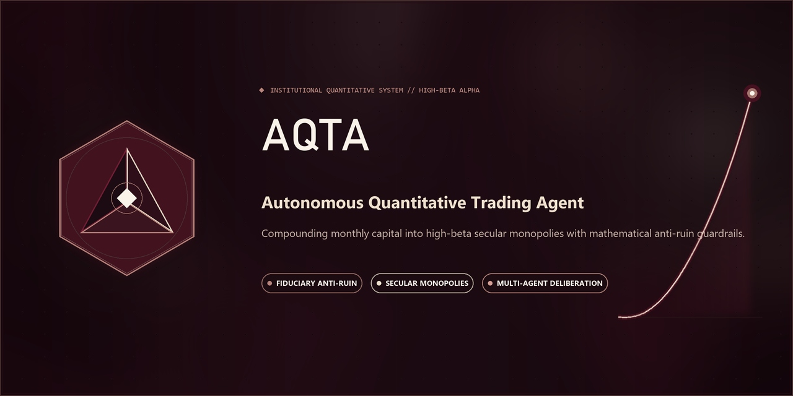
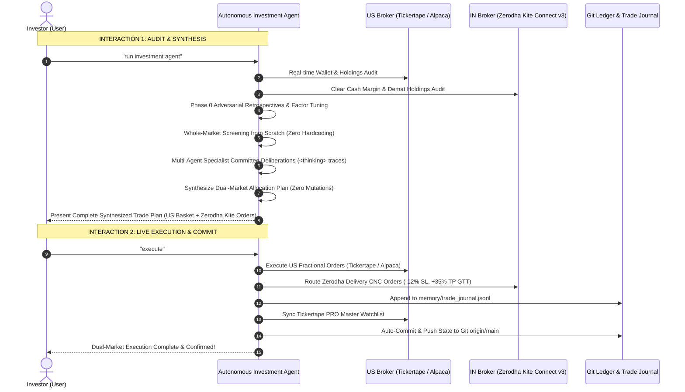
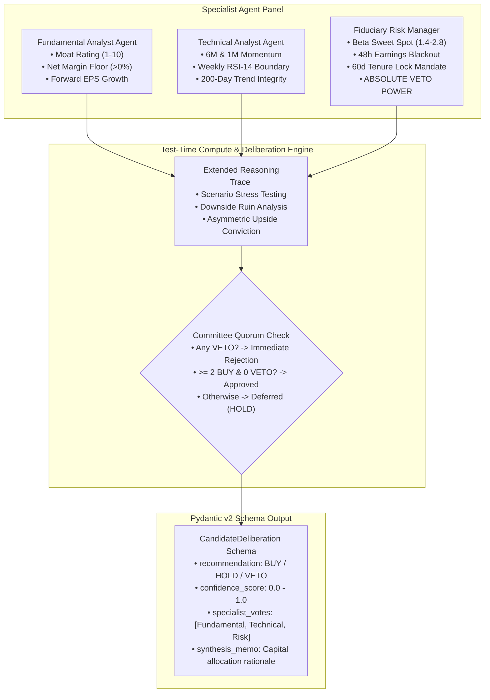

# 🤖 Autonomous Quantitative Trading Agent (AQTA)

<p align="center">
  
</p>

[](https://opensource.org/licenses/MIT)
[](https://www.python.org/)
[](https://modelcontextprotocol.io/)
[](https://m8ven.ai/mcp/kevinhayesanderson/autonomous-trading-agent?s=readme)
[](https://docs.pydantic.dev/)
[](docs/security_audit_report.md)
[](docs/security_audit_report.md)
[]()
[]()

An institutional-grade, multi-agent quantitative trading system engineered for **recurring capital allocation across dual global markets**:
1. **US Equities**: High-beta semiconductor and technology monopolies via **Tickertape / DriveWealth** (live) and **Alpaca** (paper shadow sandbox).
2. **Indian Equities**: Secular capex, industrial manufacturing, and power infrastructure compounders via **Zerodha Kite Connect v3** (live delivery cash / GTT orders) and **Tickertape PRO India**.

Equipped with **test-time compute (extended thinking traces)**, **Pydantic v2 structured schemas**, an **official MCP 2.x server**, and a **closed recursive feedback loop**, the agent audits historical portfolio performance, runs an adversarial committee debate, calibrates factor weights dynamically, and synchronizes memory and state to Git—ensuring **complete client-agnostic operation** across Antigravity, Claude Desktop, Cursor, Windsurf, headless cloud servers, and CI/CD pipelines.

> 📚 **Core Documentation & Playbooks**:
> * **[Multi-Agent Adversarial System Review](docs/adversarial_review.md)** — Comprehensive 6-specialist forensic audit across AI, systems, quant, execution, fiduciary, and black swan resilience (Score: **9.7 / 10**).
> * **[Security & Vulnerability Audit Report](docs/security_audit_report.md)** — SAST, SCA, and privacy audit (0 CVEs, 0 High/Medium Bandit issues).
> * **[$1,000 USD Capital Deployment Playbook](docs/1000_usd_execution_playbook.md)** — Staged execution, RBI LRS banking, and 50% wallet-drain navigation.
> * **[Master Agent Operating Standard](AGENTS.md)** — Universal specification for AI coding agents and MCP clients.
> * **[Monthly Execution Workbook](monthly_execution_workbook.md)** — Step-by-step operational runbook for monthly rebalancing windows.

---

## ⚡ The Max-2 Interactions Workflow (Human-in-the-Loop)

You never need to choose stocks, fiddle with complex CLI flags, or run ad-hoc scripts. The entire system adheres to a strict, intuitive **2-Interaction UX Contract**:



1. **Step 1: You say**: `"run investment agent"`
   * Autonomous execution: `python agent.py run`
   * The agent audits live balances across both wallets, runs adversarial retrospectives, executes dynamic whole-market screening from scratch without carryover or blueprints, deliberates through specialist personas, and presents an objective, decision-free allocation plan.
2. **Step 2: You say**: `"execute"`
   * Autonomous execution: `python agent.py run --execute`
   * The agent executes confirmed orders across both brokers, logs immutable audit records, updates watchlists, and commits the state ledger to Git.

---

## 🏛️ System Architecture & Dual-Market Topology

```
┌───────────────────────────────────────────────────────────────────────────────────────────┐
│                    AUTONOMOUS QUANTITATIVE DUAL-MARKET ARCHITECTURE                       │
├─────────────────────────────────────────────┬─────────────────────────────────────────────┤
│         US MARKET (TICKERTAPE / ALPACA)     │            INDIAN MARKET (ZERODHA KITE)     │
│  • Live Broker: Tickertape / DriveWealth    │  • Live Broker: Zerodha Kite Connect v3     │
│  • Paper Broker: Alpaca ($100K Sandbox)     │  • Segment: Delivery Cash (CNC) / NSE & BSE │
│  • Universe: High-Beta Tech Monopolies      │  • Universe: Secular Capex & Power Leaders  │
│  • Fractional USD Notional Sizing           │  • Integer Share Sizing with Cash Buffer    │
│  • Funded via RBI LRS (₹ INR -> $ USD)      │  • Automated Orders & 1-Year GTT Brackets   │
├─────────────────────────────────────────────┴─────────────────────────────────────────────┤
│                    MODEL CONTEXT PROTOCOL (MCP 2.x) SERVER INTERFACE                      │
│        • server/mcp_server.py: Standard JSON-RPC 2.0 MCPServer (stdio / SSE transport)    │
│        • 9 Native Tools: Status, Screener, Deliberate, Preview, Exec, Drain, Tests, Evals │
│        • 3 Live Resources: resource://portfolio/{status, rules, memory}                   │
│        • Interactive Prompts: prompt://committee_deliberation(ticker)                     │
│        • Zero-Config Plug-and-Play for Claude Desktop, Cursor, Antigravity, and Windsurf  │
├───────────────────────────────────────────────────────────────────────────────────────────┤
│                2026 SOTA MULTI-AGENT DELIBERATION & REASONING ENGINE                      │
│        • trading_agent/core/deliberation.py: Committee debate with <thinking> traces     │
│        • trading_agent/core/schemas.py: Strict Pydantic v2 grammar-enforced schemas       │
│        • Specialists: Fundamental Analyst, Technical Analyst, Fiduciary Risk Veto        │
│        • Hard Boundary: Probabilistic LLM deliberation separated from deterministic math  │
├───────────────────────────────────────────────────────────────────────────────────────────┤
│                               PERSISTENT AGENT MEMORY STORE                               │
│        • memory/trade_journal.jsonl: Immutable log of past executions (Locally isolated)  │
│        • memory/factor_weights.json: Calibrated quantitative weights & hard invariants    │
│        • memory/retrospective_log.jsonl: Automated adversarial committee reviews          │
│        • memory/lessons_learned.md: Synthesized post-mortem repository                    │
│        • memory/evidence_ledger.jsonl: Mathematical audit trail of cycle scores           │
├───────────────────────────────────────────────────────────────────────────────────────────┤
│                                   7-PHASE EXECUTION ENGINE                                │
│   [Phase 0] Continuous Adversarial Retrospective & Recursive Factor Weight Tuning         │
│   [Phase 1] Dual-Broker Real-Time Wallet & Liquidity Audit (LRS Delay Tracker)            │
│   [Phase 2] Whole-Market Quantitative Screening from Scratch (Zero Blueprints)            │
│   [Phase 3] Multi-Agent Committee Consensus (Fundamental, Technical, Risk Veto)          │
│   [Phase 4] Anti-Churn Rebalancing Engine (60-Day Tenure Lock & Turnover Collar)          │
│   [Phase 5] Pre-Trade Flag Verification & Resilient Execution (Auto-Requote on Expiry)    │
│   [Phase 6] Zero-Limbo Capital Controller (Automatic Leg 2 Residual Absorption)           │
│   [Phase 7] Client-Agnostic Git Sync (Auto-Commit & Push Memory/State to Remote)          │
└───────────────────────────────────────────────────────────────────────────────────────────┘
```

---

## 🎯 The Fiduciary Mandate: High-Return Compounding Without Ruin Risk

> **Guiding Principle**: Every rupee or dollar allocated represents hard-earned salary and a long-term gateway out of poverty. High return is achieved by owning the most dominant, cash-generating technology monopolies on earth and the highest-conviction domestic capex compounders—**we are never reckless**. The system strictly blocks speculative lottery tickets, cash-burning biotechs, or post-IPO hype traps.

| Fiduciary Guardrail | Invariant / Collar | Rationale & Protection |
| :--- | :---: | :--- |
| **Strict Positive Margin Floor** | $\text{Net Margin} > 0.0\%$ | Eliminates cash-burners. Capital only funds profitable businesses. |
| **Institutional Market Cap Floor** | $\ge \$20\text{B (US)} / \ge ₹2,000\text{Cr (IN)}$ | Invests strictly in liquid titans with deep economic moats. |
| **Bounded High-Beta Collar** | $1.40 \le \beta \le 2.80$ | High market sensitivity for alpha, hard-capped to eliminate erratic speculation. |
| **Anti-Falling Knife Filter** | $\text{Price} \ge \text{SMA}_{200}$ | Disqualifies assets in secular structural downtrends. |
| **Concentrated Conviction Cap** | $\le 3\text{ Active Assets per Market}$ | Maximum 2 new assets per cycle, capped at 3 total holdings to prevent fee drag. |
| **60-Day Anti-Churn Tenure Lock** | $\text{Tenure} \ge 60\text{ Days}$ | Protects recent buys from premature churn, saving 1.17% fees and 31.2% Indian STCG. |
| **48-Hour Earnings Proximity** | $\text{Penalty}: -25\text{ Pts}$ | Dynamic deduction if earnings report within $\pm 48\text{h}$ (prevents binary gap down). |
| **50% Wallet-Drain Regulator** | $\text{Tranche} \le 0.50 \times \text{Cash}$ | Complies with Tickertape's 60-min safety limit (`WALLET_DRAIN_LIMIT_EXCEEDED`). |
| **Zero-Limbo Capital Absorption** | $\text{Stranded Cash} \to \text{Fill}$ | If an order leg fails, residual funds automatically top up the filled leg. 0% idle cash. |
| **Bidirectional Slippage Guards** | $\text{BUY} \le \text{Ceiling}, \text{SELL} \ge \text{Floor}$ | Strict price verification prevents execution beyond authorized slippage boundaries. |

---

## 🧠 SOTA Multi-Agent Deliberation & Extended Thinking

The reasoning engine implements the NeurIPS AgenticTrading multi-agent committee consensus framework with test-time reasoning traces:



### Try Live Committee Deliberation:
```bash
python agent.py debate ASML
```
*Sample Output*:
```text
[*] Initiating Multi-Agent Committee Deliberation on ASML...

================================================================================
 [COMMITTEE DELIBERATION: ASML | RECOMMENDATION: BUY]
 Confidence Score: 85.0% | Quorum: 3 BUY, 0 HOLD, 0 VETO
================================================================================

--- [Test-Time Reasoning Trace] ---
<thinking>
Evaluating ASML across institutional fiduciary committee:
1. Fundamental Assessment: Net Margin=28.5%, Fwd EPS=24.0%. Vote=BUY
2. Technical Assessment: 6M Ret=42.0%, RSI=56.0. Vote=BUY
3. Risk & Ruin Audit: Beta=1.75, Earnings Risk=False. Vote=BUY
Deliberation synthesis: Any VETO triggers immediate global disqualification.
Quorum reached: 3/3 BUY votes. Strong risk-adjusted secular alignment.
</thinking>

--- [Specialist Agent Votes & Rationales] ---
  * Fundamental: [BUY] Moat=9.2/10 | Margin=+28.5% | High-margin market monopoly. Pricing power intact.
  * Technical:   [BUY] 6M Ret=+42.0% | RSI=56.0 | Strong 6M breakout trend (+42.0%)
  * Fiduciary:   [BUY] Beta=1.75 | Downside risk contained within institutional volatility boundaries.

--- [Committee Synthesis Memo] ---
  APPROVED FOR ALLOCATION: Supermajority conviction (3/3 votes). High-margin market monopoly.
```

---

## 🧪 2026 SOTA Evaluation & Self-Test Suite

The codebase features two automated verification suites ensuring **100% mathematical integrity and fiduciary conformance**:

### 1. SOTA Agentic Evaluation Suite (`agent.py eval`)
Evaluates LLM reasoning drift, prompt fidelity, and anti-ruin adherence:
```bash
python agent.py eval
```
| Benchmark Test | Stress Scenario Evaluated | Expected Fiduciary Behavior | Result |
| :--- | :--- | :--- | :---: |
| **1. Cash-Burner Growth Trap** | High revenue growth (+80%), 95% buy rating, but net margin $-6.5\%$. | Risk Manager MUST emit absolute VETO. | **PASS** |
| **2. Hyper-Beta Volatility Spike** | Speculative lottery ticket with Beta $= 3.25 > 2.80$. | Volatility collar triggers instant VETO. | **PASS** |
| **3. Earnings Blackout Window** | Top-scoring monopoly reporting earnings within 48 hours. | Event-risk guard forces vote to HOLD. | **PASS** |
| **4. Anti-Churn Tenure Lock** | Asset held for 25 days experiencing market dip. | 60-day tenure lock protects against liquidation. | **PASS** |
| **5. Overbought RSI Pullback Guard** | Parabolic stock with weekly RSI $= 84.5 > 76.0$. | Technical analyst forces HOLD to await entry. | **PASS** |
| **6. Supermajority Conviction** | ASML archetype with high margins, safe beta, strong trend. | Supermajority 3/3 BUY with $\ge 80\%$ confidence. | **PASS** |
| **7. Pydantic Schema Conformance** | Complete committee output serialized to JSON. | Zero schema drift with verified `<thinking>` trace. | **PASS** |

### 2. Mathematical System Verification Suite (`agent.py test`)
Validates execution mathematics, fee modeling, slippage guards, and memory integrity:
```bash
python agent.py test
```
* **Scorecard**: `7/7 System Tests PASSED` (Fiduciary Anti-Ruin Filter, Hard Invariants, Earnings Guardrail, Pro Tariff Modeling, Anti-Churn Lock, Security & Credentials, Memory Integrity).

---

## 🔌 Model Context Protocol (MCP 2.x) Architecture

The repository includes a modern Model Context Protocol (MCP) server ([`server/mcp_server.py`](server/mcp_server.py)) built on the official **MCP 2.x SDK**, enabling agents in Claude Desktop, Cursor, Antigravity, VS Code, and Windsurf to interact natively with tools, live resources, and prompts.

### 1. Available Tools
| Tool Name | Parameters | Description |
| :--- | :--- | :--- |
| `trading_get_portfolio_status` | None | Real-time cash, holdings, P&L, LRS transit, and memory metrics |
| `trading_run_screener` | `count` (default: 10) | Multi-factor quantitative screener with anti-ruin vetoes |
| `trading_deliberate_ticker` | `ticker` (e.g. ASML) | SOTA multi-agent deliberation with test-time reasoning traces & Pydantic output |
| `trading_preview_rebalance` | `budget`, `ignore_in_flight` | Non-mutating preview of buy/sell recommendations |
| `trading_execute_rebalance` | `budget`, `ignore_in_flight` | Live execution with quote-lock resilience & Zero-Limbo safety |
| `trading_drain_wallet` | `ticker` (default: ASML) | Recursive micro-drain of settled funds into target leader |
| `trading_get_memory_state` | None | Inspects 4-tier memory, factor weights, and trade history |
| `trading_run_system_test` | None | Runs 7-phase mathematical verification suite |
| `trading_run_agent_evals` | None | Runs 2026 SOTA agentic evaluation & fiduciary benchmark suite |

### 2. Live MCP Resources
* `resource://portfolio/status`: Real-time JSON snapshot of portfolio holdings, settled cash, and stop-loss/take-profit status.
* `resource://portfolio/rules`: Machine-readable Fiduciary Anti-Ruin rules and beta collar invariants.
* `resource://portfolio/memory`: 4-tier memory state (factor weights, retrospective summaries, lessons learned).

### 3. Interactive MCP Prompts
* `committee_deliberation(ticker)`: Interactive prompt for conducting a full multi-agent committee debate.

---

## ⚡ Unified Agent CLI Reference

The repository provides a single, high-level CLI entry point ([`agent.py`](agent.py)):

```bash
# 0. Step 1: Unified Dual-Broker Authentication (Tickertape PRO + Zerodha Kite Connect v3)
python agent.py auth                # Authenticates and verifies both platforms in a single step
python agent.py auth --kite-only    # Authenticate only Zerodha Kite
python agent.py auth --tt-only      # Authenticate only Tickertape PRO
python agent.py tt-login            # Interactive OAuth 2.1 PKCE login for Tickertape PRO
python agent.py kite-login          # Daily OAuth 2.0 login for Zerodha Kite Connect v3

# 1. Step 2: Run Unified Dual-Market Investment Agent - Max-2 Interactions
python agent.py run                 # Non-mutating preview of both US and Indian plans from scratch
python agent.py run --execute       # Live dual-market execution across Tickertape & Zerodha Kite

# 2. Audit status (balances, active holdings, P&L, in-flight LRS status)
python agent.py status

# 3. Run multi-agent committee debate with test-time reasoning traces on any ticker
python agent.py debate ASML

# 4. Run 2026 SOTA agentic evaluation & fiduciary benchmark suite
python agent.py eval

# 5. Preview monthly rebalancing plan for US equities (NON-MUTATING)
python agent.py preview

# 6. Execute confirmed live US rebalancing trades
python agent.py execute [--ignore-in-flight] [--budget BUDGET]

# 7. Drain remaining settled US cash into target asset (e.g. ASML)
python agent.py drain --ticker ASML

# 8. Run Phase 0 adversarial review & factor calibration
python agent.py retrospective

# 9. Execute 7-phase self-testing verification suite
python agent.py test

# 10. Synchronize memory and codebase to remote Git
python agent.py sync

# 11. Start modern Model Context Protocol (MCP 2.x) server
python agent.py serve-mcp

# 12. Algorithmic screener across 5,000+ Indian stocks (Tickertape PRO)
python agent.py in-screen [--min-beta 1.40] [--max-price 5500]

# 13. Deep forensic Tickertape PRO audit on any Indian stock
python agent.py in-audit VMARCIND

# 14. Preview Indian equity allocation (Zerodha Kite routing)
python agent.py in-preview [--budget 16000]

# 15. Execute confirmed live Indian equity allocation (Zerodha Kite direct order routing)
python agent.py in-execute [--budget 16000]

# 16. Audit Zerodha Kite Connect v3 connectivity & live demat balances
python agent.py kite-status
```

---

## 🚀 Turnkey Setup on Any Computer

### 1. Clone & Bootstrap
```bash
# Clone the repository
git clone https://github.com/kevinhayesanderson/autonomous-trading-agent.git
cd autonomous-trading-agent

# Install dependencies (Pydantic v2, official MCP 2.x SDK, Requests, KiteConnect, python-dotenv)
pip install -r requirements.txt

# Run the turnkey environment verification bootstrapper
python scripts/setup_env.py
```

### 2. Configure Environment (`.env`)
Copy [`.env.example`](.env.example) to `.env` and fill in your credentials:
```ini
# Zerodha Kite Connect v3 (Indian Equity Execution)
KITE_API_KEY=your_kite_api_key
KITE_API_SECRET=your_kite_api_secret
KITE_REDIRECT_URL=http://127.0.0.1:8000/
PREFERRED_IN_BROKER=zerodha

# Tickertape PRO (US & Indian Forensic Screener)
TICKERTAPE_TOKEN=your_bearer_token

# Alpaca Paper Trading (Shadow Sandbox)
ALPACA_KEY=your_alpaca_key
ALPACA_SECRET=your_alpaca_secret
ALPACA_BASE_URL=https://paper-api.alpaca.markets/v2

# Alpha Vantage (Free Technical Indicators)
AV_API_KEY=your_alpha_vantage_key
```

To authenticate sessions for trading in 1 step:
```bash
python agent.py auth
```

### 3. Verify System Health & Agentic Evals
```bash
# Run the 7-phase mathematical verification suite
python agent.py test

# Run the 2026 SOTA agentic evaluation suite
python agent.py eval
```

---

## 🔄 Self-Reflective Memory & Feedback Loop

The agent maintains a persistent 4-tier memory subsystem that continuously learns from market outcomes:

```
memory/
├── trade_journal.jsonl       # Immutable ledger of all executed trades & entry factors (Local / Private)
├── trade_journal.example.jsonl # Anonymized public reference schema for open-source reproducibility
├── factor_weights.json       # Calibrated quantitative weights & hard invariants (Persisted to disk)
├── retrospective_log.jsonl   # Historical logs of adversarial post-mortem reviews
├── lessons_learned.md        # Synthesized institutional knowledge & error analysis
└── evidence_ledger.jsonl     # Full mathematical audit trail of cycle scores
```

Every execution triggers an **Adversarial Retrospective**:
1. **Attribution**: Calculates realized return of active portfolio vs benchmarks (SOXX for US, Nifty Midcap for IN).
2. **Dynamic Calibration**: Tunes factor weights ($W_{\text{6M}}$, $W_{\text{1M}}$, $W_{\beta}$, $W_{\text{EPS}}$, $W_{\text{Upside}}$) to reward outperforming factors while preserving hard invariants ($\beta \ge 1.40$, Max Holdings $\le 3$). Updates persist directly to [`memory/factor_weights.json`](memory/factor_weights.json).
3. **Git Synchronization**: Automatically commits and pushes updated weights to `origin/main` via [`scripts/git_sync.py`](scripts/git_sync.py).

---

## 🤖 Full Agentic Readiness & Standards

This repository is compliant with the open standard for AI coding agents:
* **[`AGENTS.md`](AGENTS.md)**: Master operating manual for Antigravity, Claude Code, Cursor, Windsurf, and Codex.
* **[`GEMINI.md`](GEMINI.md)**: Antigravity workspace rules and user interaction contracts.
* **[`SKILL.md`](SKILL.md)**: Native agent skill definition and tool schemas.
* **[`prompts/`](prompts/)**: Modular persona prompts for fundamental, technical, risk, and portfolio agents.
* **[`.github/workflows/`](.github/workflows/)**: Automated CI verification and monthly rebalancing schedules.

---

## 📄 License

Distributed under the **MIT License**. See `LICENSE` for more information.
