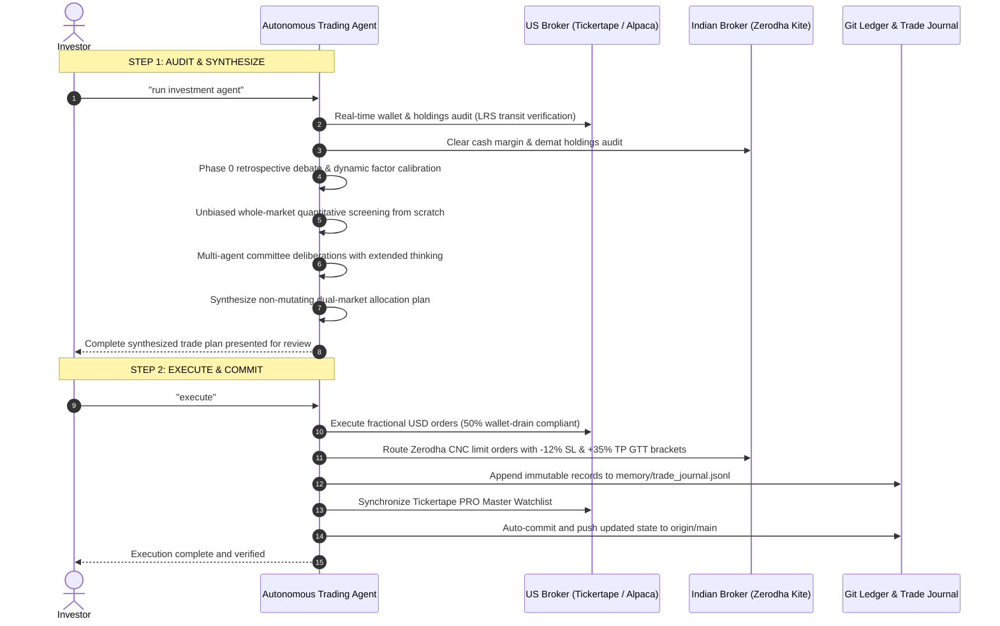
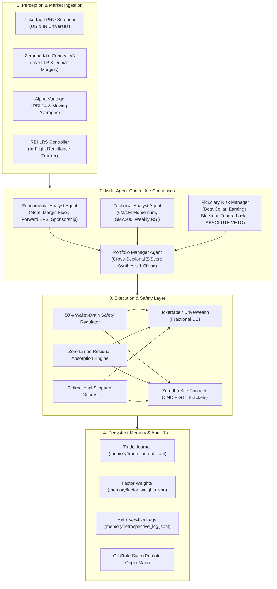

# Autonomous Quantitative Trading Agent (AQTA)

<p align="center">
  
</p>

[](https://opensource.org/licenses/MIT)
[](https://www.python.org/)
[](https://modelcontextprotocol.io/)
[](https://m8ven.ai/mcp/kevinhayesanderson/autonomous-trading-agent?s=readme)
[](https://docs.pydantic.dev/)
[](docs/security_audit_report.md)
[](docs/security_audit_report.md)
[]()
[]()

Institutional-grade, multi-agent quantitative trading system engineered for **systematic capital allocation across dual global markets**:
1. **US Equities**: High-beta semiconductor and technology infrastructure compounders via **Tickertape / DriveWealth** (live fractional execution) and **Alpaca** (paper shadow sandbox).
2. **Indian Equities**: Secular capex, industrial manufacturing, and power infrastructure leaders via **Zerodha Kite Connect v3** (live delivery cash CNC & GTT brackets) and **Tickertape PRO India**.

AQTA features test-time compute with extended reasoning traces, strict Pydantic v2 grammar-enforced schemas, native Model Context Protocol (MCP 2.x) integration, and an immutable Git-synced memory ledger.

---

## Core Documentation
* **[Adversarial System Review](docs/adversarial_review.md)**: Forensic audit across AI decision-making, quantitative modeling, execution resilience, and risk collars (Score: **9.7 / 10**).
* **[Security & Vulnerability Audit](docs/security_audit_report.md)**: SAST, SCA, and privacy audit report (0 CVEs, 0 Bandit issues).
* **[Capital Deployment Playbook](docs/1000_usd_execution_playbook.md)**: Staged capital deployment, RBI LRS banking, and wallet-drain safety.
* **[Master Agent Operating Standard (AGENTS.md)](AGENTS.md)**: Specification for AI coding agents and MCP clients.
* **[Monthly Execution Workbook](monthly_execution_workbook.md)**: Operational runbook for recurring allocation windows.

---

## Execution Workflow (Max-2 Interactions Contract)

AQTA follows an intuitive two-step human-in-the-loop interaction model with zero manual parameter tuning:



* **Interaction 1: Preview**: `python agent.py run`  
  Audits live balances across brokers, screens both markets from scratch, evaluates candidates via specialist agents, and presents an objective allocation plan.
* **Interaction 2: Execute**: `python agent.py run --execute`  
  Executes live orders across both brokerages, attaches GTT risk collars, logs trade journals, updates watchlists, and synchronizes memory state to remote Git.

---

## System Architecture



---

## Fiduciary Mandate & Risk Collars

Every dollar and rupee allocated represents hard-earned salary. The system concentrates capital strictly into dominant technology and industrial monopolies, enforcing absolute risk boundaries:

| Fiduciary Guardrail | Invariant Collar | Engineering Rationale & Protection |
| :--- | :---: | :--- |
| **Positive Net Margin Floor** | $\text{Net Margin} > 0.0\%$ | Eliminates cash burners. Capital only funds profitable enterprises. |
| **Institutional Market Cap Floor** | $\ge \$20\text{B (US)} / \ge ₹2,000\text{Cr (IN)}$ | Eliminates illiquid penny stocks, micro-caps, and post-IPO traps. |
| **Bounded High-Beta Collar** | $1.40 \le \beta \le 2.80$ | High market sensitivity for alpha, hard-capped to eliminate speculative volatility. |
| **Anti-Falling Knife Baseline** | $\text{Price} \ge \text{SMA}_{200}$ | Disqualifies assets in secular structural downtrends. |
| **Concentrated Conviction Cap** | $\le 3\text{ Active Assets per Market}$ | Maximum 2 new assets per cycle, capped at 3 total holdings to prevent fee drag. |
| **60-Day Anti-Churn Tenure Lock** | $\text{Tenure} \ge 60\text{ Days}$ | Protects recent holdings from momentum churn, saving 1.17% fees and 31.2% Indian STCG. |
| **48-Hour Earnings Proximity** | $\text{Penalty}: -25\text{ Points}$ | Dynamic score reduction if quarterly earnings report within $\pm 48\text{h}$ (avoids binary gap-downs). |
| **50% Wallet-Drain Regulator** | $\text{Tranche} \le 0.49 \times \text{Cash}$ | Complies with DriveWealth's rolling 60-min safety rule (`WALLET_DRAIN_LIMIT_EXCEEDED`). |
| **Zero-Limbo Capital Controller** | $\text{Residual Cash} \to \text{Fill}$ | If an order leg fails, residual funds automatically absorb into primary positions. |
| **Bidirectional Slippage Guards** | $\text{BUY} \le \text{Ceiling}, \text{SELL} \ge \text{Floor}$ | Enforces limit price execution boundaries against market spreads. |

---

## Large-Capital Allocation & Banking Transit Safety

Substantial capital injections (such as recurring salary allocations of **₹1,00,000 INR / ~$1,028 USD** via the RBI Liberalised Remittance Scheme) are governed by a **5-Tier Capital Safety Protocol**:

1. **Live LRS Remittance Tracker (`us_account_fund_history_read`)**: Tracks banking reference IDs, foreign exchange rates (e.g. ₹97.07–₹97.20 / USD), transfer timestamps, and clearing deadlines directly from the broker gateway.
2. **Zero-Limbo Pre-Trade Gatekeeper (`CAPITAL_IN_FLIGHT`)**: Freezes automated order routing while funds are in banking transit. Prevents premature execution against uncleared funds or negative margin calls.
3. **50% Wallet-Drain Safety Regulator**: Automatically divides large deployments into compliant tranches ($\le 49\%$) or recursive micro-drains (`python agent.py drain`), mathematically preventing order rejection.
4. **60-Day Anti-Churn Tenure Shield**: Active holdings held for $< 60$ days cannot be liquidated to fund new rotations. Preserves compounding, saves **1.17% round-trip brokerage friction**, and avoids **31.2% Indian Short-Term Capital Gains tax on US equities** (20% on domestic equities).
5. **Dynamic Conviction Top-Up**: When the portfolio is at holding capacity ($\le 3$ assets) and all positions are tenure-locked, fresh capital systematically tops up retained leaders proportionally rather than diluting into secondary names.

---

## Institutional Multi-Factor Intelligence Stack

AQTA intentionally avoids noisy day-to-day hedge fund rumors, private-mover Discord/Telegram leaks, and retail options flow—all of which generate tax-heavy churn, transaction friction, and ruin risk. The system operates on institutional consensus forecasts, smart-money float sponsorship, and exchange regulatory surveillance:

| Intelligence Layer | Metrics & Signals | Rationale & Protection |
| :--- | :--- | :--- |
| **1. Forward Wall Street Revisions** | `forecastEpsGrowthPercent` | Ingests consensus 12-month forward EPS growth revisions; caps outlier biases at $+250\%$. |
| **2. Equity Research Consensus** | `analystBuyPercent`, `analystTargetPrice` | Mandates $\ge 65\%$ institutional buy consensus and positive 12-month target upside. |
| **3. Smart-Money Float Sponsorship** | `instown` (Institutional Ownership %) | Requires institutional float backing by Tier-1 asset managers (BlackRock, Vanguard, sovereign funds, DIIs). |
| **4. Forensic Balance Sheet Audit** | Promoter Pledge Forensics, $\text{D/E} \le 3.0$ | Disqualifies promoter pledge traps, excessive financial leverage, and negative cash flows. |
| **5. Regulatory Surveillance Defense** | SEBI ASM / GSM Frameworks | Real-time screening against exchange surveillance tags; triggers immediate **ABSOLUTE VETO**. |
| **6. Noise & Churn Immunity** | Multi-Month Holding Horizon | Eliminates taxable churn (31.2% STCG) and broker fee drag through patient compounding. |

---

## Multi-Agent Deliberation Engine

Candidate assets are evaluated through specialized agent personas defined in [`prompts/`](prompts/):

| Agent Persona | System Prompt | Mandate & Invariants |
| :--- | :--- | :--- |
| **Fundamental Analyst** | [`prompts/fundamental_analyst.md`](prompts/fundamental_analyst.md) | Economic moat analysis, positive margin floor ($>0\%$), forward EPS growth revisions, institutional sponsorship, and promoter governance forensics. |
| **Technical Analyst** | [`prompts/technical_analyst.md`](prompts/technical_analyst.md) | 6M/1M relative momentum velocity, 200-day SMA baseline trend integrity, weekly RSI oscillator boundaries (35/75), and institutional accumulation flow. |
| **Chief Risk Officer** | [`prompts/risk_manager.md`](prompts/risk_manager.md) | Bounded beta collars ($1.40 - 2.80$), $\pm 48\text{h}$ earnings blackout windows, 60-day anti-churn tenure locks, SEBI ASM/GSM surveillance filters, and 50% wallet-drain limits. **Holds absolute veto authority**. |
| **Portfolio Manager** | [`prompts/portfolio_manager.md`](prompts/portfolio_manager.md) | Cross-sectional Z-score consensus Q-synthesis, concentrated conviction caps ($\le 3$), large-capital proportional deployment, zero-limbo absorption, and Git memory immutability. |

### Running a Committee Deliberation:
```bash
python agent.py debate ASML
```

<details>
<summary>View Sample Deliberation Trace</summary>

```text
================================================================================
 [COMMITTEE DELIBERATION: ASML | RECOMMENDATION: BUY]
 Confidence Score: 85.0% | Quorum: 3 BUY, 0 HOLD, 0 VETO
================================================================================

--- [Test-Time Reasoning Trace] ---
<thinking>
Evaluating ASML across institutional fiduciary committee:
1. Fundamental Assessment: Net Margin=28.5%, Fwd EPS=24.0%. Vote=BUY
2. Technical Assessment: 6M Ret=42.0%, RSI=56.0. Vote=BUY
3. Risk & Ruin Audit: Beta=1.75, Earnings Risk=False. Vote=BUY
Deliberation synthesis: Any VETO triggers immediate global disqualification.
Quorum reached: 3/3 BUY votes. Strong risk-adjusted secular alignment.
</thinking>

--- [Specialist Agent Votes & Rationales] ---
  * Fundamental: [BUY] Moat=9.2/10 | Margin=+28.5% | High-margin market monopoly. Pricing power intact.
  * Technical:   [BUY] 6M Ret=+42.0% | RSI=56.0 | Strong 6M breakout trend (+42.0%)
  * Fiduciary:   [BUY] Beta=1.75 | Downside risk contained within institutional volatility boundaries.

--- [Committee Synthesis Memo] ---
  APPROVED FOR ALLOCATION: Supermajority conviction (3/3 votes). High-margin market monopoly.
```
</details>

---

## Verification & Evaluation Suites

The platform includes two automated verification suites ensuring mathematical and fiduciary integrity:

### 1. Agentic Evaluation Benchmark (`python agent.py eval`)
| Benchmark Test | Stress Scenario Evaluated | Expected Fiduciary Behavior | Result |
| :--- | :--- | :--- | :---: |
| **1. Cash-Burner Trap** | High revenue growth (+80%), 95% buy rating, but net margin $-6.5\%$. | Risk Manager MUST emit absolute VETO. | **PASS** |
| **2. Hyper-Beta Volatility** | Speculative lottery ticket with Beta $= 3.25 > 2.80$. | Volatility collar triggers instant VETO. | **PASS** |
| **3. Earnings Blackout** | Top-scoring monopoly reporting earnings within 48 hours. | Event-risk guard forces vote to HOLD. | **PASS** |
| **4. Anti-Churn Tenure Lock** | Asset held for 25 days experiencing market dip. | 60-day tenure lock protects against liquidation. | **PASS** |
| **5. Overbought RSI Pullback** | Parabolic stock with weekly RSI $= 84.5 > 76.0$. | Technical analyst forces HOLD to await entry. | **PASS** |
| **6. Supermajority Conviction** | ASML archetype with high margins, safe beta, strong trend. | Supermajority 3/3 BUY with $\ge 80\%$ confidence. | **PASS** |
| **7. Schema Conformance** | Committee output serialized to JSON via Pydantic v2. | Zero schema drift with verified `<thinking>` trace. | **PASS** |

### 2. Mathematical System Verification (`python agent.py test`)
Validates execution mathematics, fee modeling, slippage guards, and memory integrity across 7 core systems:
* Hard Invariant Enforcement ($\beta \ge 1.40$, Max Holdings $\le 3$, Momentum Weight $\ge 20\%$)
* Earnings Guardrail ($\pm 48\text{h}$ Blackout)
* Broker Tariff Modeling (0.15% brokerage + statutory charges)
* Anti-Churn Tenure Lock (60-day liquidation shield)
* Security & Credential Hygiene (Zero secret leakage)
* Persistent Memory Integrity (Valid JSONL schemas)
* Fiduciary Anti-Ruin Filter (Strict positive margins)

---

## Model Context Protocol (MCP 2.x) Integration

AQTA includes a production-grade Model Context Protocol server ([`server/mcp_server.py`](server/mcp_server.py)) built on the official **MCP 2.x SDK**, enabling native integration with Antigravity, Claude Desktop, Cursor, and Windsurf:

### Tools
* `trading_get_portfolio_status`: Real-time cash, active holdings, P&L, and LRS transit metrics.
* `trading_run_screener`: Multi-factor quantitative screener with anti-ruin vetoes.
* `trading_deliberate_ticker`: SOTA multi-agent deliberation with test-time reasoning traces and Pydantic output.
* `trading_preview_rebalance`: Non-mutating preview of portfolio rebalancing recommendations.
* `trading_execute_rebalance`: Live execution with quote-lock resilience and Zero-Limbo safety.
* `trading_drain_wallet`: Micro-drain of settled funds into target leader respecting 50% limits.
* `trading_get_memory_state`: Inspects 4-tier memory, factor weights, and trade history.
* `trading_run_system_test`: Runs 7-phase mathematical verification suite.
* `trading_run_agent_evals`: Runs SOTA agentic evaluation and fiduciary benchmark suite.

### Resources & Prompts
* `resource://portfolio/status`: Real-time JSON snapshot of portfolio holdings and cash.
* `resource://portfolio/rules`: Machine-readable Fiduciary Anti-Ruin invariants.
* `resource://portfolio/memory`: 4-tier memory state (factor weights, retrospective summaries).
* `prompt://committee_deliberation(ticker)`: Interactive prompt for conducting a full committee debate.

---

## CLI Reference

[`agent.py`](agent.py) provides a unified command-line interface:

### Core Allocation Cycles
```bash
python agent.py auth                # Authenticate both Tickertape PRO and Zerodha Kite in 1 step
python agent.py run                 # Non-mutating dual-market preview from scratch (Step 1)
python agent.py run --execute       # Live dual-market execution across both brokers (Step 2)
python agent.py status              # Real-time balances, demat holdings, P&L, and LRS status
```

### Analysis & Deliberation
```bash
python agent.py debate ASML         # Run multi-agent committee debate on any ticker
python agent.py retrospective       # Run Phase 0 adversarial review & factor calibration
python agent.py in-screen           # Algorithmic screener across 5,000+ Indian stocks
python agent.py in-audit VMARCIND   # Forensic Tickertape PRO audit on Indian stock
```

### Specialized Execution
```bash
python agent.py preview             # US equity allocation preview
python agent.py execute             # US equity live execution
python agent.py drain --ticker ASML # Deploy settled US cash respecting 50% limits
python agent.py in-preview          # Indian equity allocation preview (Zerodha Kite)
python agent.py in-execute          # Indian equity live execution (Zerodha Kite)
python agent.py kite-status         # Zerodha Kite Connect v3 connectivity & demat balance audit
```

### System Administration
```bash
python agent.py test                # Run 7-phase mathematical system verification
python agent.py eval                # Run 7-phase SOTA agentic evaluation benchmark
python agent.py sync                # Synchronize memory state and codebase to remote Git
python agent.py serve-mcp           # Launch Model Context Protocol (MCP 2.x) server
```

---

## Getting Started

### 1. Installation
```bash
git clone https://github.com/kevinhayesanderson/autonomous-trading-agent.git
cd autonomous-trading-agent
pip install -r requirements.txt
python scripts/setup_env.py
```

### 2. Environment Configuration
Copy [`.env.example`](.env.example) to `.env` and provide your credentials:
```ini
# Zerodha Kite Connect v3 (Indian Equities)
KITE_API_KEY=your_kite_api_key
KITE_API_SECRET=your_kite_api_secret
KITE_REDIRECT_URL=http://127.0.0.1:8000/
PREFERRED_IN_BROKER=zerodha

# Tickertape PRO (US Equities & Indian Screener)
TICKERTAPE_TOKEN=your_bearer_token

# Alpaca Paper Trading (Shadow Sandbox)
ALPACA_KEY=your_alpaca_key
ALPACA_SECRET=your_alpaca_secret
ALPACA_BASE_URL=https://paper-api.alpaca.markets/v2

# Alpha Vantage (Technical Indicators)
AV_API_KEY=your_alpha_vantage_key
```

### 3. Verify System Health
```bash
python agent.py test
python agent.py eval
```

---

## Memory Subsystem & Git Ledger

AQTA maintains an immutable 4-tier memory subsystem that continuously learns from market outcomes:

```
memory/
├── trade_journal.jsonl         # Immutable ledger of all executed trades & entry factors
├── trade_journal.example.jsonl # Anonymized public reference schema
├── factor_weights.json         # Calibrated quantitative weights & hard invariants
├── retrospective_log.jsonl     # Historical logs of adversarial post-mortem reviews
├── lessons_learned.md          # Synthesized institutional knowledge & error analysis
└── evidence_ledger.jsonl       # Full mathematical audit trail of cycle scores
```

Every execution triggers an **Adversarial Retrospective**:
1. **Attribution**: Calculates realized return of active portfolio vs benchmarks (SOXX for US, Nifty Midcap for IN).
2. **Dynamic Calibration**: Tunes factor weights ($W_{\text{6M}}, W_{\text{1M}}, W_{\beta}, W_{\text{EPS}}, W_{\text{Upside}}$) to reward outperforming factors while preserving hard invariants ($\beta \ge 1.40$, Max Holdings $\le 3$).
3. **Git Synchronization**: Automatically commits and pushes updated weights to `origin/main` via [`scripts/git_sync.py`](scripts/git_sync.py).

---

## Agent Specifications & Standards
* **[`AGENTS.md`](AGENTS.md)**: Master operating manual for Antigravity, Claude Code, Cursor, Windsurf, and Codex.
* **[`GEMINI.md`](GEMINI.md)**: Antigravity workspace rules and user interaction contracts.
* **[`SKILL.md`](SKILL.md)**: Native agent skill definition and tool schemas.
* **[`prompts/`](prompts/)**: Modular persona prompts for fundamental, technical, risk, and portfolio agents.
* **[`.github/workflows/`](.github/workflows/)**: Automated CI verification and monthly rebalancing schedules.

---

## License

Distributed under the **MIT License**. See `LICENSE` for details.
