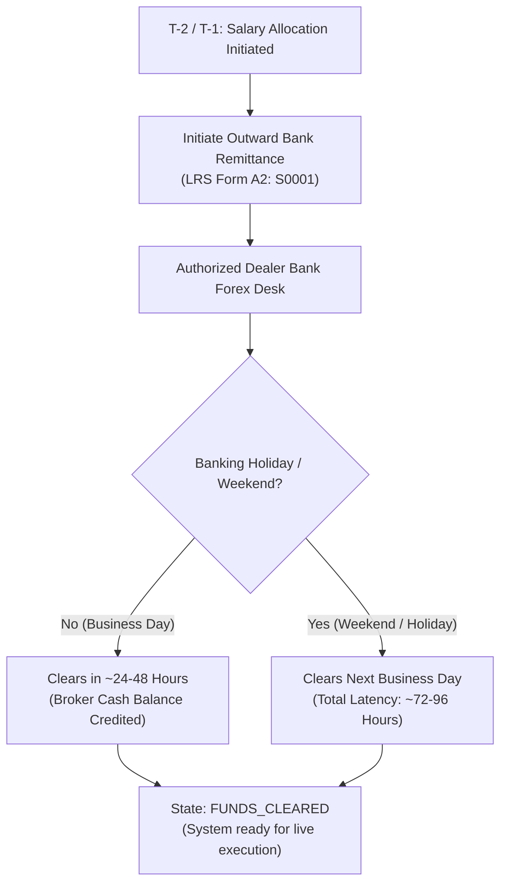
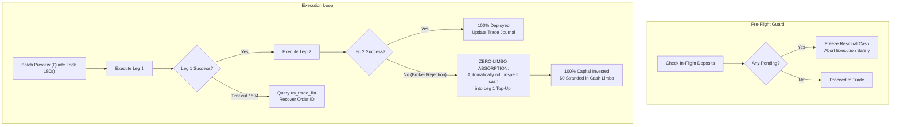

# Institutional Monthly Execution Workbook & Runbook
> **System**: Autonomous Quantitative Trading Agent (AQTA)  
> **Markets**: US Equities (Tickertape / Alpaca) & Indian Equities (Zerodha Kite Connect v3)  
> **Cadence**: Recurring Monthly Capital Allocation  

An institutional quantitative investment operations workbook for deploying recurring capital across high-beta US technology monopolies and Indian domestic secular capex compounders.

---

## 1. Executive Summary & Production Status

| Architecture Pillar | Verification Status | Production Mechanism |
| :--- | :---: | :--- |
| **User Command Contract** | **ACTIVE** | **Strict 2-Command UX**: `"run investment agent"` $\to$ preview plan; `"execute"` $\to$ execute confirmed trades. |
| **Dual-Broker Architecture** | **ACTIVE** | **US**: Tickertape / DriveWealth (Fractional USD). **India**: Zerodha Kite Connect v3 (Delivery CNC / AMO / GTT). |
| **Tickertape PRO Integration** | **ACTIVE** | Unlocked: Net Margin, ROE, 50D/200D SMA, Fwd EPS, Analyst Buy %, pre-trade flags, and 5,000+ Indian stock screener. |
| **Zero-Limbo Capital Safety** | **ACTIVE** | **In-flight deposit lockout** + **Quote-lock auto-refresh** + **Automatic residual cash absorption** (unspent cash dynamically absorbs into successful fills). |
| **Anti-Churn Turnover Lock** | **ACTIVE** | **60-Day Tenure Lock**: Assets held $< 60$ days cannot be replaced by discretionary churn. |
| **Self-Improving Feedback Loop** | **ACTIVE** | **Phase 0 Retrospective** in persistent memory (`memory/`). Read-only during previews; factor weight calibrations persisted to disk upon execution. |
| **Autonomous Verification Gate** | **ACTIVE** | **7/7 Automated System Tests** (`python agent.py test`) + **7/7 SOTA Agentic Evals** (`python agent.py eval`) passing with 100% fiduciary conformance. |
| **Tickertape Pro Tariff Modeling** | **ACTIVE** | **Dynamic Fee Modeling**: Exact 0.15% base brokerage + statutory allowances + $0.20 cash safety buffer. |
| **Alpaca Shadow Sandbox** | **ACTIVE** | Autonomous background verification of Alpaca paper account shadow sandbox. Zero manual inspection required. |

---

## 2. Monthly Timeline & Banking Clearance Protocol

### The LRS Clearance Dynamics
Outward remittances under the RBI Liberalised Remittance Scheme (LRS) typically clear in **24 to 48 hours** on standard business days, and up to **72–96 hours** across weekends or exchange bank holidays.



### The 3-State Capital Controller

The agent automatically classifies account funding status:
1. **`STATE 1: FUNDS_CLEARED`** ($\ge \$45.00$ USD settled, 0 pending deposits):
   - All systems green. Sizes trades against available cash and executes allocation.
2. **`STATE 2: CAPITAL_IN_FLIGHT`** (Pending deposit in `us_account_fund_history`):
   - **Zero-Limbo Safety Lock**: Residual settled cash is locked to prevent premature micro-trades or double fees.
   - Outputs a forward preview of the plan and estimated clearance window.
3. **`STATE 3: UNFUNDED_ACCOUNT`** ($< \$10.00$ USD settled, 0 pending deposits):
   - Prompts initiation of banking transfer.

---

## 3. The 2-Step Command Workflow

```
┌────────────────────────────────────────────────────────────────────────┐
│                        THE 2-COMMAND CONTRACT                          │
├────────────────────────────────────────────────────────────────────────┤
│ Step 1: You say: "run investment agent"                                │
│         └──> Agent executes: python agent.py run                       │
│              (Audits dual wallets, Phase 0 retrospectives,             │
│               whole-market screening from scratch without carryover,   │
│               multi-agent committee deliberations, and                 │
│               generates exact dual-market trade allocations)           │
│                                                                        │
│ Step 2: You review the preview and say: "execute"                      │
│         └──> Agent executes: python agent.py run --execute             │
│              (Commits confirmed US orders to Tickertape/Alpaca,        │
│               routes Zerodha Kite CNC / GTT delivery orders, records   │
│               immutable trade journal logs, and syncs state to Git)    │
└────────────────────────────────────────────────────────────────────────┘
```

---

## 4. Dual-Market Screening & Quality Rules

### Screening Universes & Thresholds
- **US Universe**: US Equities with $\text{Beta} \ge 1.40$, $\text{Market Cap} \ge \$20\text{ Billion}$, $\text{Net Margin} > 0.0\%$.
- **Indian Universe**: 5,000+ NSE/BSE Equities with $\text{Beta} \ge 1.40$, $\text{Market Cap} \ge ₹2,000\text{ Crore}$, $\text{ROE} \ge 12\%$, $\text{Operating Margin} \ge 10\%$.
- **Quality & Profitability Filter**:
  - Net Margin $\le 0\%$ or operating losses $\to$ **Immediate Fiduciary VETO**.
  - High Net Margin and ROE $\to$ **Score Boost**.
- **Technical Trend Filter**:
  - $\text{Price} < \text{SMA}_{200} \to$ **Disqualified** (anti-falling knife).
  - Overbought RSI $\ge 75 \to$ **-15 Point Penalty**.
  - Oversold RSI $\le 35 \to$ **+10 Point Boost**.
- **Composite Z-Score Standardization**: Cross-sectionally standardizes factors to prevent single-factor distortion.
- **Multi-Agent Consensus**: Fundamental Analyst, Technical Analyst, and Fiduciary Risk Manager deliberate to produce final allocations.

---

## 5. Portfolio Rebalancing & 60-Day Anti-Churn Tenure Lock

### Tenure Lock Economics:
- Selling an asset held $< 60$ days creates broker exit fees, currency friction, and 31.2% Indian Short-Term Capital Gains (STCG) tax drag on foreign equities (20% on domestic equities).
- **Rule**: No asset held $< 60$ days can be replaced for discretionary momentum turnover. Only a breached Stop-Loss (-12%) or Take-Profit (+35%) collar forces an exit before 60 days.
- When holding capacity ($\le 3$ assets) is reached and assets are locked, fresh capital proportionally tops up existing leaders.

---

## 6. Zero-Limbo Capital Safety Architecture



---

## 7. Emergency Mobile Failover Runbook

If terminal access drops on execution day, orders can be placed manually on the broker mobile apps in under 3 minutes:

```
┌────────────────────────────────────────────────────────────────────────┐
│               EMERGENCY MOBILE FAILOVER RUNBOOK                        │
├────────────────────────────────────────────────────────────────────────┤
│ US STOCKS (Tickertape / DriveWealth App):                              │
│ 1. Open Broker App -> 'Portfolio' -> Verify Settled Cash balance.      │
│ 2. Search target approved ticker (e.g. 'ASML' or 'NVDA').              │
│ 3. Tap 'Buy' -> Enter allocated notional amount -> Limit (+1.0%).      │
│ 4. Swipe to Confirm.                                                   │
│                                                                        │
│ INDIAN STOCKS (Zerodha Kite App / Web):                                │
│ 1. Open Kite App -> 'Funds' -> Verify Available Cash.                  │
│ 2. Search approved ticker (e.g. 'SIGMAADV', 'KIRLOSENG', 'MARINE').     │
│ 3. Tap 'Buy' -> Select 'CNC (Longterm)' -> Enter calculated Qty.       │
│ 4. Tap 'Create GTT' -> -12% Stop-Loss Trigger, +35% Target Trigger.    │
│ 5. Swipe to submit Delivery / GTT order.                               │
└────────────────────────────────────────────────────────────────────────┘
```

---

## 8. Summary of Hard Invariants

1. **Minimum Portfolio Beta $\ge 1.40$**: Alpha sensitivity without defensive drag.
2. **Concentrated Conviction ($\le 3$ Assets per Market)**: High-conviction compounder focus.
3. **Pure-Play Market Monopolies & Capex Compounders**: Foundries, accelerators, EUV lithography, and domestic capital goods leaders.
4. **Human-in-the-Loop Confirmation**: Live trades are never fired without explicit review and approval.
