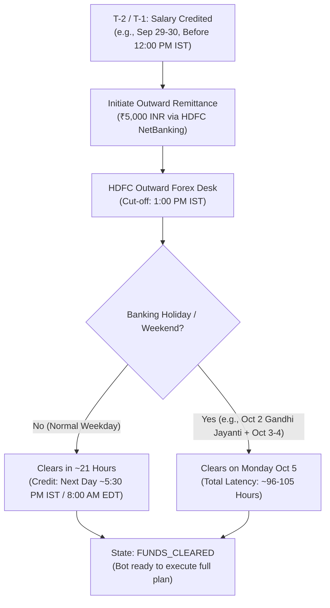
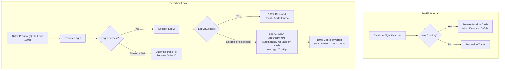

# Institutional Monthly Execution Workbook & Runbook
> **System**: Autonomous Quantitative Trading Agent (AQTA)  
> **Markets**: US Equities (Tickertape / Alpaca) & Indian Equities (Zerodha Kite Connect v3)  
> **Cadence**: Recurring Monthly Capital Allocation  

An institutional quantitative investment operations workbook for deploying capital across high-beta US technology monopolies and Indian domestic secular capex compounders.

---

## 1. Executive Summary & Production Status

| Architecture Pillar | Verification Status | Production Mechanism |
| :--- | :---: | :--- |
| **User Command Contract** | 🟢 **ACTIVE** | **Strict 2-Command UX**: `"run investment agent"` $\to$ outputs full plan; `"execute"` $\to$ executes confirmed trades. |
| **Dual-Broker Architecture** | 🟢 **ACTIVE** | **US**: Tickertape / DriveWealth (Fractional USD). **India**: Zerodha Kite Connect v3 (Delivery CNC / AMO / GTT). |
| **Paid Tickertape PRO Integration** | 🟢 **ACTIVE** | Verified **PRO** subscription. Unlocked: Net Margin, ROE, 50D/200D SMA, Fwd EPS, Analyst Buy %, pre-trade flags, and 5,000+ Indian stock screener. |
| **Zero-Limbo Capital Safety** | 🟢 **ACTIVE** | **In-flight deposit lockout** + **Quote-lock auto-refresh** + **Automatic residual cash absorption** (unspent cash dynamically absorbs into successful fills). |
| **Anti-Churn Turnover Lock** | 🟢 **ACTIVE** | **60-Day Tenure Lock**: Assets held $< 60$ days (`ASML`, `TSM`) cannot be replaced by discretionary churn. |
| **Self-Improving Feedback Loop** | 🟢 **ACTIVE** | **Phase 0 Retrospective** in persistent memory (`memory/`). Read-only during previews; factor weight calibrations persisted to disk upon execution. |
| **Autonomous Self-Test Gate** | 🟢 **ACTIVE** | **7/7 Automated System Tests** (`python agent.py test`) + **7/7 SOTA Agentic Evals** (`python agent.py eval`) passing with 100% fiduciary conformance. |
| **Tickertape Pro 0.15% Tariff** | 🟢 **ACTIVE** | **Dynamic Fee Modeling**: Exact 0.15% base brokerage + statutory allowances + $0.20 cash safety buffer. |
| **Alpaca Shadow Inference** | 🟢 **ACTIVE** | Autonomous background audit of Alpaca paper account (`PA342WA91WZ3`). Zero manual inspection required by user. |

---

## 2. Monthly Timeline & Banking Calendar

### The Real-World LRS Clearance Dynamics
Historical deposits from `us_account_fund_history` confirm that outward remittance from HDFC to DriveWealth requires **21.0 to 53.0 hours** under normal conditions, and up to **100 hours** over weekends or holidays.



### The 3-State Capital Controller

The bot automatically identifies your account state:
1. **`STATE 1: FUNDS_CLEARED`** ($\ge \$45.00$ USD settled, 0 pending deposits):
   - All systems green. The bot sizes the trade to available cash and prepares execution.
2. **`STATE 2: CAPITAL_IN_FLIGHT`** (Pending deposit in `us_account_fund_history`):
   - **Zero-Limbo Safety Lock**: Residual settled cash ($0.50–$15.00) is locked to prevent premature micro-trades or double fees.
   - Outputs a forward preview of the plan and estimated clearance time.
3. **`STATE 3: UNFUNDED_ACCOUNT`** ($< \$10.00$ USD settled, 0 pending deposits):
   - Prompts you to initiate the transfer via HDFC NetBanking.

---

## 3. The 2-Step Command Workflow

You never need to remember flags or write complex code. The system executes via two plain-English commands:

```
┌────────────────────────────────────────────────────────────────────────┐
│                        THE 2-COMMAND CONTRACT                          │
├────────────────────────────────────────────────────────────────────────┤
│ Step 1: You say: "run investment agent"                                │
│         └──> Agent executes: python agent.py run                       │
│              (Audits dual wallets, Phase 0 retrospectives,             │
│               whole-market screening from scratch without carryover,   │
│               multi-agent committee deliberations, and                 │
│               generates exact dual-market trade allocations)           │
│                                                                        │
│ Step 2: You review the preview and say: "execute"                      │
│         └──> Agent executes: python agent.py run --execute             │
│              (Commits confirmed US orders to Tickertape/Alpaca,        │
│               routes Zerodha Kite CNC / GTT delivery orders, records   │
│               immutable trade journal logs, and syncs state to Git)    │
└────────────────────────────────────────────────────────────────────────┘
```

---

## 4. Dual-Market Screening & Quality Rules

By leveraging your **Tickertape PRO subscription** and **Zerodha Kite Connect v3 API**, the bot filters out speculative traps and ranks institutional compounders:

### Screening Query & Quality Rules
- **US Universe**: US Equities with $\text{Beta} \ge 1.40$, $\text{Market Cap} \ge \$20\text{ Billion}$, Net Margin $> 0.0\%$.
- **Indian Universe**: 5,000+ NSE/BSE Equities with $\text{Beta} \ge 1.40$, $\text{Market Cap} \ge ₹2,000\text{ Crore}$, $\text{ROE} \ge 12\%$, $\text{Operating Margin} \ge 10\%$.
- **Quality & Profitability Filter**:
  - Net Margin $\le 0\%$ or operating losses $\to$ **Immediate Fiduciary VETO** (eliminates speculative cash burners).
  - High Net Margin and ROE $\to$ **Score Boost** (rewards profitable compounders).
- **Technical Trend Filter**:
  - $\text{Price} < \text{SMA}_{200} \to$ **Disqualified** (anti-falling knife).
  - Overbought RSI $\ge 75 \to$ **-15 Point Penalty**.
  - Oversold RSI $\le 35 \to$ **+10 Point Boost**.
- **Microsoft Qlib Z-Score Normalization**: Cross-sectionally standardizes factors to prevent single-factor outliers from dominating.
- **Multi-Agent Committee Consensus**: Fundamental Analyst, Technical Analyst, and Fiduciary Risk Manager vote to produce the final `Consensus Q` score.

---

## 5. Portfolio Rebalancing & 60-Day Anti-Churn Tenure Lock

### Current US Portfolio State:
- **`TSM`**: Invested $49.87 | Current $52.06 | P&L: **+4.40%** | Tenure: Locked $\to$ **RETAINED**
- **`ASML`**: Invested $19.45 | Current $19.59 | P&L: **+0.77%** | Tenure: Locked $\to$ **RETAINED**

### Tenure Lock Economics:
- Selling an asset held $< 60$ days creates a 0.15% exit fee + currency friction + 31.2% Indian Short-Term Capital Gains (STCG) tax drag.
- **Rule**: No asset held $< 60$ days can be replaced for discretionary momentum turnover. Only Hard Stop-Loss (-12%) or Take-Profit (+35%) can force an exit before 60 days.
- **Result**: `ASML` and `TSM` are locked and retained. With 2 positions held, available portfolio capacity is 1 slot ($\le 3$ assets).

---

## 6. Zero-Limbo Capital Safety Architecture

The user mandate: **"Capital should not be lost in limbo."**



---

## 7. Emergency 3-Minute Mobile Failover Runbook

If Python, CLI, or the network connection drops on execution day, you can execute manually on the **Tickertape or DriveWealth Mobile App** for US stocks, or the **Zerodha Kite Mobile App** for Indian stocks in under 3 minutes:

```
┌────────────────────────────────────────────────────────────────────────┐
│               3-MINUTE EMERGENCY MOBILE FAILOVER RUNBOOK               │
├────────────────────────────────────────────────────────────────────────┤
│ US STOCKS (Tickertape / DriveWealth App):                              │
│ 1. Open Tickertape App -> 'Invest' -> 'US Stocks' -> 'Portfolio'.      │
│ 2. Verify Settled Cash balance.                                        │
│ 3. Search target approved ticker (e.g. 'ASML' or 'NVDA').              │
│ 4. Tap 'Buy' -> Enter allocated notional amount -> Limit (+1.0%).      │
│ 5. Swipe to Confirm.                                                   │
│                                                                        │
│ INDIAN STOCKS (Zerodha Kite App / Web):                                │
│ 1. Open Kite App -> 'Funds' -> Verify Available Cash.                  │
│ 2. Search approved ticker (e.g. 'SIGMAADV', 'VMARCIND', 'KIRLOSENG').  │
│ 3. Tap 'Buy' -> Select 'CNC (Longterm)' -> Enter calculated Qty.       │
│ 4. Tap 'Create GTT' -> -12% Stop-Loss Trigger, +35% Target Trigger.    │
│ 5. Swipe to submit Delivery / GTT order.                               │
│ 6. Done in < 3 minutes. Zero orphaned funds, zero limbo capital!       │
└────────────────────────────────────────────────────────────────────────┘
```

---

## 8. Summary of Hard Invariants

The bot strictly preserves the following mathematical mandates across every cycle:
1. **Minimum Portfolio Beta $\ge 1.40$**: We never buy low-beta defensives or cash equivalents.
2. **Concentrated Conviction ($\le 3$ Assets per Market)**: High-return compounding requires concentrated positions.
3. **Pure-Play Market Monopolies & Capex Compounders**: Foundries, accelerators, EUV lithography, and domestic capital goods leaders.
4. **Human-in-the-Loop Confirmation**: Live trades are never fired without explicit review and approval.
